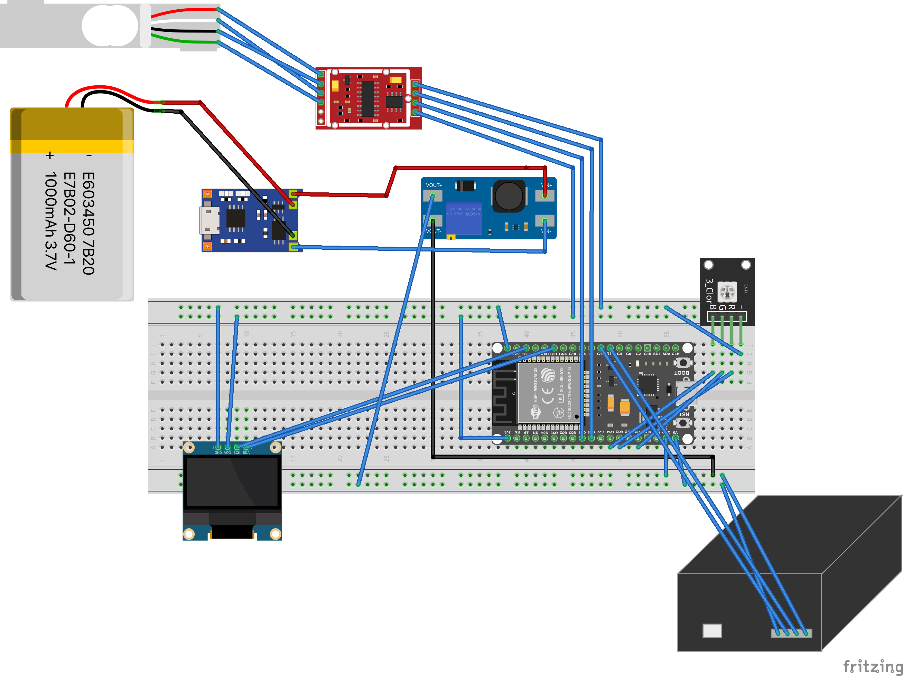
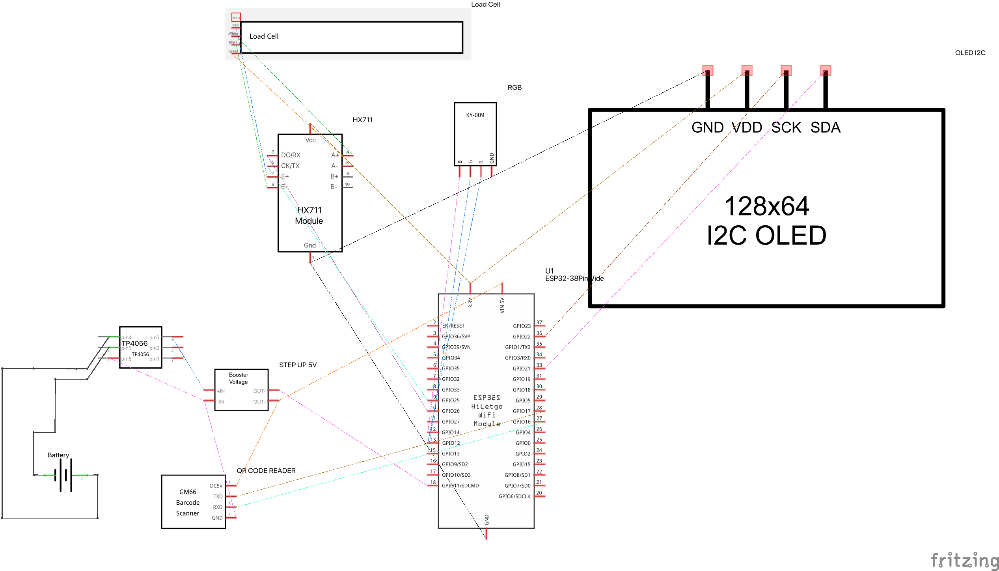

# Bilancia da Frigo

## Introduzione
In questo progetto descriviamo una bilancia intelligente basata su ESP32, dotata di un sensore di peso e di un lettore di codici a barre. La bilancia è in grado di misurare la massa di un oggetto, leggere il codice a barre per identificarlo e, eventualmente, inviare notifiche o memorizzare i dati su un servizio esterno.

## Componenti
Componenti principali:
- **ESP32**: MCU principale che gestisce la logica, la comunicazione e l’elaborazione dei dati. NodeMCU-32 board ESP32 WROOM-32 
- **Cella di carico**: connesso all’ESP32 per la misura del carico tramite un regolatore HX711, convertitore analogico-digitale (ADC) a 24 bit. Questo consente di dividere il segnale di tensione della cella di carico in 2^24 (circa 16 milioni) di passi, fornendo una risoluzione estremamente alta e permettendo di misurare cambiamenti molto piccoli nel peso.
- **Lettore di codici a barre**: consente di riconoscere automaticamente il prodotto appoggiato sulla bilancia. MH-ET LIVE basato su GM65. 
- **Circuito di carica**: composto da un TP4056 e una batteria LiPo 3,7v 1000mAh. Tra il TP4056 e ESP32 (Vin 5v) abbiamo inserito un regolatore Step-up (Pololu 5V Step-Up/Step-Down Voltage Regulator S7V8F5). TP4056 gestisce la carica della batteria e invia al regolatore ESP32 il voltaggio corretto di alimentazione 
- **Schermo OLED**: utilizzato per messaggi relativi all'oggetto, peso, comunicazioni o eventuali errori. OLED 1.3" da AZ con connessione IIC

## Altre componenti
- Piatti in plexiglass 3mm per 20cm di diametro
- Rivetti da incollare nel plexiglass
- Bulloni senza testa per fissare la cella di carico ai piatti in plexiglass

## Schema Sistema
 

## Funzionamento
1. **Identificazione dell’oggetto**: Viene eseguita la scansione del codice a barre per recuperare informazioni sul prodotto. Il codice GTIN rilevato veine inviato al server di openfoodfacts che restituisce i dati sotoforma di file JSON. Registriamo il peso previsto o il volume (500ml, 1000ml) e calcoliamo le soglie 50% o 20% ecc... 
2. **Lettura del peso**: L’ESP32 acquisisce i segnali dal sensore di peso. L'oggetto viene appoggiato sulla piattaforma di peso. Appena il peso si stabilizza viene elaborato l'algoritmo di calcolo delle soglie.
3. **Elaborazione dei dati**: L’ESP32 elabora peso e codice, eseguendo calcoli e memorizzando i risultati. Quando la precentuale di prodotto residuo si attesta al di sotto di una soglia prestabilita viene inviato un messaggio al server MQTT (...o altro servizio).
4. **Notifica o interfacciamento**: ESP32 si collega a un server https di openfoodfacts.org che accetta richieste con il codice GTIN del prodotto letto dal sensore 1D/2D. Il server restituisce dati del prodotto in formato JSON.
Questi dati possono essere utilizzati per calcolare il valore peso soglia sotto il quale viene inviato un mesaggio al servere MQTT (...)

## Librerie Utilizzate
- **Arduino.h**: Libreria base di Arduino, include funzioni fondamentali (`digitalWrite`, `millis`, ecc.).
- **Wire.h**: Gestione della comunicazione I²C (OLED, sensori, ecc.).
- **WiFi.h**: Connessione WiFi per ESP32.
- **WiFiClientSecure.h**: Connessioni HTTPS con supporto TLS.
- **WiFiManager.h**: Configurazione del WiFi tramite captive portal.
- **HTTPClient.h**: Comunicazione HTTP/HTTPS per ottenere dati da API REST.
- **ArduinoJson.h**: Parsing di dati JSON in modo strutturato ed efficiente.
- **U8g2lib.h**: Gestione di display OLED monocromatici via I²C/SPI.
- **HX711.h**: Interfaccia per moduli di lettura peso (celle di carico).
- **Preferences.h**: Memorizzazione persistente di configurazioni su memoria flash.
- **nvs_flash.h**: Inizializzazione del sottosistema NVS (Non-Volatile Storage).
- **PubSubClient.h**: Comunicazione MQTT per pubblicazione/sottoscrizione di messaggi.
- **UniversalTelegramBot.h**: Interfaccia per invio/ricezione messaggi Telegram tramite bot.
- **WebServer.h**: Web server HTTP integrato per interfacce locali.
- **battery.h**: Gestione livello batteria (modulo del progetto).
- **display_manager.h**: Controllo del display OLED (modulo del progetto).
- **globals.h**: Definizioni globali condivise (modulo del progetto).
- **id_bilancia.h**: Identificativo e configurazione della bilancia (modulo del progetto).
- **led_rgb_controller.h**: Gestione LED RGB tramite PWM (modulo del progetto).
- **qr_func.h**: Lettura e gestione dei codici QR (modulo del progetto).
- **wifi_manager.h**: Wrapper personalizzato per WiFiManager (modulo del progetto).

## Librerie  create (non trovate alternative)
- display_manager.h // Gestione più semplice dei font per il testo da inviare all'OLED
- led_rgb_controller.h // Gestione e test componente SMD RGB e attivare colori base chiamando una semplice funzione 

## File principali
- main.ino // File principale che contiene la logica principale del programma

## File di configurazione
- globals.h // File di configurazione globale

## Gestione Consumo Batteria
Il progetto viene alimentato da una batteria a lipo di 3,7V 1000mAh. Per gestire il consumo della batteria abbiamo utilizzato un circuito di carica TP4056 e un regolatore Step-up (Pololu 5V Step-Up/Step-Down Voltage Regulator S7V8F5). TP4056 gestisce la carica della batteria e invia al regolatore ESP32 il voltaggio corretto di alimentazione. Abbiamo bisogno di due linee una a 3.3v e una a 5v per alimentare ESP32 e i diversi attuatori. La baord viene alimentata a 5v e si sfrutta il pin 3v3 per alimentare lo schermo OLED, il led RGB e il sensore di peso HX711. Il lettore di codici a barre MH-ET LIVE utilizza 5v condivisi in uscita dallo step up. La board si accende e viene alimentata dalla batteria consumando massimo 160mAh + 120mAh per il GM65 e 15mAh per il HX711, 60mAh per il led RGB 
che in caso di idle al 10% consuma 6mAh.

## Consumo Energetico per Componente (stima su 1h)
| Componente        | Stato                      | Corrente (mA) | Durata per ora     | Consumo (mAh) |
|-------------------|----------------------------|---------------|--------------------|---------------|
| **ESP32**         | Attivo + 20sec WiFi TX     | 60 o 130      | (200 s) + (40s)    | 3.484         |
|                   | Deep Sleep                 | 0.01          | 56 min             | 0.009         |
| **GM65 QR**       | Scansione (120 mA)         | 120           | 20s                | 0.66          |
|                   | Standby / Deep Sleep       | 8 / 0.01      | 59'56"             | 7.995 / 0.01  |
|                   | Deep Sleep                 | 0.01          | 56 min             | 0.009         | 
| **HX711**         | Attivo                     | 1.5           | 4 min              | 0.1           |
|                   | Power down                 | 0.001         | 56 min             | 0.001         |
| **LED RGB**       | PWM @ 10% intensità        | 6             | 4 min              | 0.4           |
|                   | Spento                     | 0             | 56 min             | 0             |

| **Totale (GM65 stand by)**                                    | **86,88 ore**      | **12,66 mAh** |    
| **Totale (GM65 spento)**                                      | **235,29 ore**     | **4,675 mAh** |     

### Fonti e documentazione

- [ESP32 Datasheet - Espressif](https://www.espressif.com/sites/default/files/documentation/esp32_datasheet_en.pdf)
- [HX711 Datasheet](https://cdn.sparkfun.com/datasheets/Sensors/Force/hx711_english.pdf)
- [GM65 QR Module Specs - Waveshare](https://www.waveshare.com/wiki/QR_Code_Scanner_Module_(UART))

Con un mosfet N si potrebbe spegnere il circuito di alimentazione del GM65 quando non viene utilizzato. Si potrebbero risparmiare circa 8mAh al'ora quindi 192mAh al giorno, allungando la vita della batteria da 86,88 ore a 235,29 ore. Con una batteria da 2000mAh si potrebbe avere una vita di circa 20 giorni. Se invece di avere un controllo ogni 30 minuti avessimo un controllo ogni ora si potrebbero risparmiare altri 1.7mAh si allungherebbe la vita a 95 o 379 ore (cioè potremmo arrivare fino a 15 giorni, raddoppiando la capacità della batteria circa un mese). Disattivando il BT potri risparmiare anora altri 0.33mAh all'ora quindi circa 8mAh al giorno.

### Sviluppi futuri

Con dei livelli inferiori al 20% del peso originale del prodotto si potrebbe inviare un messaggio Telegram o inviare un'email o un SMS al proprietario del frigo. Un Telegram bot non è complicato ma comporta comunque una registrazione attiva dall'utente. WhatsApp o SMS sono opzioni che comportano un costo a messaggio.
Attualmente il servizio invia un messaggio ogni volta che la bilancia rileva che il prodotto è sotto la soglia prestabilita ma solo se il peso cambia del 10% rispetto alla pesata precedente. Il richio è che se il peso originale fosse 1000 e pesiamo 199 e poi 99 il sistema manderebbe due messaggi. Si potrebbe utilizzare una logica con un valore nelle preferenze che invia solo se non è stato inviato precedentemente

## Conclusioni
Il sistema illustrato rappresenta un prototipo di bilancia “smart” che può essere impiegata in contesti domestici per esempio in frigo dove appoggiando un prodotto saremo automaticamente avvertiti se la quantità residua del prodotto è sotto una certa soglia e quindi vine e richiesto il nuovo approviggionamento dello stesso prodotto.

